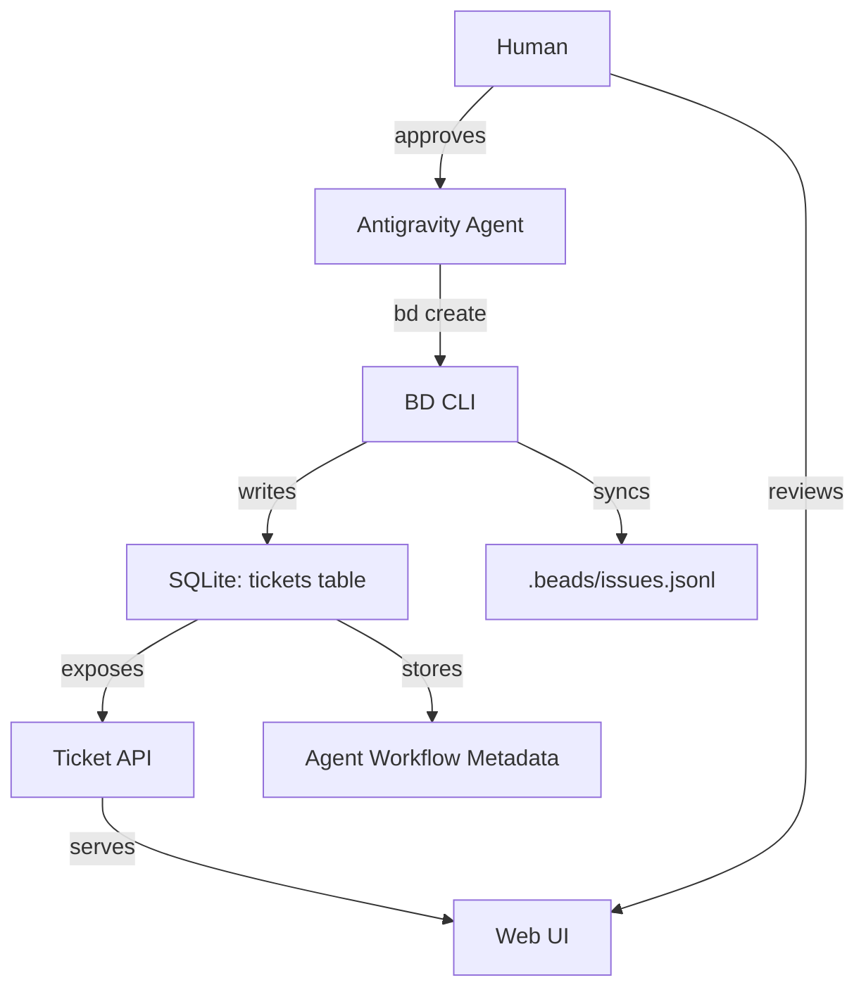

# Implementation Plan: Integrate Beads Issue Tracking with Ticket System

## Executive Summary

This plan proposes integrating **bd (beads)** issue tracking functionality directly into the existing memos ticket system. The goal is to create **durable storage of agent thoughts, processes, and workflows** in the SQLite database (`bin/memos/data/memos_dev.db`), following the AGENTS.MD requirements strictly.

## Current State Analysis

### Existing Ticket Implementation

**Backend (Go):**
- ✅ Store interface: [`store/ticket.go`](file:///home/chaschel/Documents/ibm/go/base/store/ticket.go)
- ✅ SQLite implementation: [`store/db/sqlite/ticket.go`](file:///home/chaschel/Documents/ibm/go/base/store/db/sqlite/ticket.go)
- ✅ API endpoints: [`server/router/api/v1/ticket_service.go`](file:///home/chaschel/Documents/ibm/go/base/server/router/api/v1/ticket_service.go)
- ✅ Database table: `tickets` (via migrations in `store/migration/sqlite/0.25/`)

**Current Ticket Schema:**
```sql
CREATE TABLE tickets (
    id INTEGER PRIMARY KEY AUTOINCREMENT,
    title TEXT NOT NULL,
    description TEXT NOT NULL,  -- Currently stores "/m/{memoUID}" links
    status TEXT NOT NULL,        -- OPEN, IN_PROGRESS, CLOSED
    priority TEXT NOT NULL,      -- LOW, MEDIUM, HIGH
    creator_id INTEGER NOT NULL,
    assignee_id INTEGER,
    created_ts INTEGER NOT NULL,
    updated_ts INTEGER NOT NULL,
    type TEXT,                   -- TASK, BUG, STORY
    tags TEXT                    -- JSON array
);
```

**Frontend (React):**
- ✅ Ticket list/board view: [`web/src/pages/Tickets.tsx`](file:///home/chaschel/Documents/ibm/go/base/web/src/pages/Tickets.tsx)
- ✅ Comments via memo relations (COMMENT type)
- ✅ Description via memo links (`/m/{uid}`)

### AGENTS.MD Requirements

**Core Principles from AGENTS.MD:**
> **"If it is not in Beads, it does not exist."**

**Required workflow integration:**
1. **Issue Creation**: Every ticket MUST be created via `bd create` command
2. **Issue Lifecycle**: Status updates via `bd update`, `bd close`
3. **Dependencies**: Link related tickets via `bd dep add`
4. **Priority mapping**: P0-P4 system maps to ticket priorities
5. **Type mapping**: bug, feature, task, epic, chore, docs, investigation
6. **Single Source of Truth**: SQLite database stores ALL metadata
7. **Git sync**: `bd sync` syncs with `.beads/issues.jsonl`
8. **Session workflow**: Follow "Landing the Plane" protocol

## Problem Statement

**Current issues:**
1. ❌ Tickets are created directly via API without `bd` integration
2. ❌ No persistent agent workflow/process tracking in database
3. ❌ No dependency graph between tickets
4. ❌ No epic support with hierarchical relationships
5. ❌ Priority system doesn't match P0-P4 required by AGENTS.MD
6. ❌ Missing issue metadata: labels, dependencies, discovered-from links
7. ❌ No `bd` CLI integration for ticket operations
8. ❌ Agent thoughts/processes not durably stored

## Proposed Solution

### Architecture Overview



### Design Decisions

#### Option 1: **Extend Tickets Table (RECOMMENDED)**
- Add beads-specific columns to existing `tickets` table
- Map beads concepts to ticket fields
- Keep existing UI mostly unchanged
- Benefits: Single source of truth, backward compatible
- Drawback: Tight coupling

#### Option 2: Dual Storage (NOT RECOMMENDED)
- Keep separate `.beads/beads.db` SQLite + `tickets` table
- Sync between them
- Benefits: Clean separation
- Drawbacks: Complexity, sync issues, violates SSOT principle

**Decision: Proceed with Option 1** - Extend tickets table to be beads-compatible.

---

## Proposed Changes

### Phase 1: Database Schema Enhancement

#### 1.1 Database Migration

**New migration file:** `store/migration/sqlite/0.25/02__beads_integration.sql`

```sql
-- Add beads-specific columns to tickets table
ALTER TABLE tickets ADD COLUMN beads_id TEXT UNIQUE;  -- e.g., "bd-a3f8e9"
ALTER TABLE tickets ADD COLUMN parent_id INTEGER REFERENCES tickets(id);  -- For epics
ALTER TABLE tickets ADD COLUMN labels TEXT;  -- JSON array: ["backend", "security"]
ALTER TABLE tickets ADD COLUMN dependencies TEXT;  -- JSON array of ticket IDs
ALTER TABLE tickets ADD COLUMN discovery_context TEXT;  -- Link to parent issue
ALTER TABLE tickets ADD COLUMN closed_reason TEXT;  -- Closure notes
ALTER TABLE tickets ADD COLUMN issue_type TEXT;  -- bug, feature, task, epic, chore, docs, investigation

-- Create index for beads_id lookups
CREATE INDEX idx_tickets_beads_id ON tickets(beads_id);
CREATE INDEX idx_tickets_parent_id ON tickets(parent_id);

-- Migration for existing tickets: set defaults
UPDATE tickets SET issue_type = COALESCE(type, 'TASK') WHERE issue_type IS NULL;
UPDATE tickets SET labels = '[]' WHERE labels IS NULL;
UPDATE tickets SET dependencies = '[]' WHERE dependencies IS NULL;
```

**Also update:** `store/migration/mysql/0.25/` and `store/migration/postgres/0.25/`

---

### Phase 2: Backend Implementation

#### 2.1 Update Ticket Model

**File:** [`store/ticket.go`](file:///home/chaschel/Documents/ibm/go/base/store/ticket.go)

```go
type Ticket struct {
    ID                int32
    BeadsID          *string  // NEW: bd-abc123
    Title             string
    Description       string
    Status            TicketStatus
    Priority          TicketPriority
    CreatorID         int32
    AssigneeID       *int32
    CreatedTs         int64
    UpdatedTs         int64
    Type              string   // Keep for backward compat
    IssueType         string   // NEW: bug, feature, task, epic, etc.
    Tags              []string // Keep existing
    Labels            []string // NEW: bd labels
    ParentID         *int32   // NEW: For epics
    Dependencies      []int32  // NEW: Blocker ticket IDs
    DiscoveryContext *string  // NEW: Link to parent issue
    ClosedReason     *string  // NEW: Closure notes
}

// Map bd priority to ticket priority
func BeadsPriorityToTicket(p int) TicketPriority {
    switch p {
    case 0, 1: return TicketPriorityHigh
    case 2:    return TicketPriorityMedium
    case 3, 4: return TicketPriorityLow
    default:   return TicketPriorityMedium
    }
}

// Map bd type to issue type
func BeadsTypeToIssueType(t string) string {
    // bug, feature, task, epic, chore, docs, investigation
    return t
}
```

#### 2.2 Add BD Integration Service

**New file:** `server/router/api/v1/beads_service.go`

```go
package v1

import (
    "context"
    "log/slog"
    "net/http"
    "os/exec"
    "encoding/json"
    
    "github.com/labstack/echo/v4"
    "github.com/usememos/memos/store"
)

// BeadsIssue represents a bd issue
type BeadsIssue struct {
    ID           string   `json:"id"`
    Title        string   `json:"title"`
    Description  string   `json:"description"`
    Type         string   `json:"type"`
    Priority     int      `json:"priority"`
    Status       string   `json:"status"`
    Labels       []string `json:"labels"`
    Dependencies []string `json:"dependencies"`
    CreatedTs    int64    `json:"created_ts"`
    UpdatedTs    int64    `json:"updated_ts"`
}

func (s *APIV1Service) RegisterBeadsRoutes(g *echo.Group) {
    g.POST("/beads/create", s.CreateBeadsIssue)
    g.PATCH("/beads/:beads_id/update", s.UpdateBeadsIssue)
    g.POST("/beads/:beads_id/close", s.CloseBeadsIssue)
    g.POST("/beads/sync", s.SyncBeads)
}

// CreateBeadsIssue executes `bd create` and stores result in tickets table
func (s *APIV1Service) CreateBeadsIssue(c echo.Context) error {
    ctx := c.Request().Context()
    userID, ok := c.Get(getUserIDContextKey()).(int32)
    if !ok {
        return echo.NewHTTPError(http.StatusUnauthorized, "Missing user in context")
    }

    var req struct {
        Title       string   `json:"title"`
        Description string   `json:"description"`
        Type        string   `json:"type"`
        Priority    int      `json:"priority"`
        Labels      []string `json:"labels"`
    }
    if err := c.Bind(&req); err != nil {
        return echo.NewHTTPError(http.StatusBadRequest, "Invalid request").SetInternal(err)
    }

    // Execute bd create command
    args := []string{
        "create", req.Title,
        "-t", req.Type,
        "-p", fmt.Sprintf("%d", req.Priority),
        "-d", req.Description,
    }
    if len(req.Labels) > 0 {
        args = append(args, "--label", strings.Join(req.Labels, ","))
    }

    cmd := exec.Command("bd", args...)
    output, err := cmd.CombinedOutput()
    if err != nil {
        slog.Error("bd create failed", "error", err, "output", string(output))
        return echo.NewHTTPError(http.StatusInternalServerError, "Failed to create issue")
    }

    // Parse bd output to extract beads_id (e.g., "bd-a3f8e9")
    beadsID := parseBeadsIDFromOutput(string(output))

    // Store in tickets table
    ticket := &store.Ticket{
        BeadsID:     &beadsID,
        Title:       req.Title,
        Description: req.Description,
        Status:      store.TicketStatusOpen,
        Priority:    store.BeadsPriorityToTicket(req.Priority),
        CreatorID:   userID,
        IssueType:   req.Type,
        Labels:      req.Labels,
        CreatedTs:   time.Now().Unix(),
        UpdatedTs:   time.Now().Unix(),
    }

    ticket, err = s.Store.CreateTicket(ctx, ticket)
    if err != nil {
        return echo.NewHTTPError(http.StatusInternalServerError, "Failed to store ticket")
    }

    return c.JSON(http.StatusOK, ticket)
}

// Similar implementations for UpdateBeadsIssue, CloseBeadsIssue, SyncBeads
```

#### 2.3 Update Existing Ticket Service

**File:** [`server/router/api/v1/ticket_service.go`](file:///home/chaschel/Documents/ibm/go/base/server/router/api/v1/ticket_service.go)

**Changes:**
- Modify `CreateTicket` to call `bd create` under the hood
- Add validation to ensure beads workflow compliance
- Add endpoints for dependencies: `POST /tickets/:id/dependencies`
- Add epic support: `GET /tickets/:id/subtasks`

---

### Phase 3: Frontend Integration

#### 3.1 Update Ticket Form

**File:** [`web/src/pages/Tickets.tsx`](file:///home/chaschel/Documents/ibm/go/base/web/src/pages/Tickets.tsx)

**Changes:**
1. **Priority**: Change from LOW/MEDIUM/HIGH to P0/P1/P2/P3/P4
2. **Issue Type**: Add full beads types (bug, feature, task, epic, chore, docs, investigation)
3. **Labels**: Add multi-select for labels (backend, frontend, security, etc.)
4. **Dependencies**: Add dependency picker (select blocking tickets)
5. **Epic Support**: Show parent-child relationships
6. **Beads ID**: Display bd-XXX ID prominently

#### 3.2 Add Dependency Visualization

**New component:** `web/src/components/TicketDependencyGraph.tsx`

Display dependency tree using a mermaid diagram or custom D3.js visualization.

---

### Phase 4: CLI Integration

#### 4.1 Add Taskfile Commands

**File:** [`Taskfile.yml`](file:///home/chaschel/Documents/ibm/go/base/Taskfile.yml)

```yaml
bd:init:
  desc: Initialize beads in this project
  cmds:
    - bd init --prefix memos

bd:sync:
  desc: Sync beads issues with git
  cmds:
    - bd sync

bd:ready:
  desc: Show available work
  cmds:
    - bd ready

bd:list:
  desc: List all open issues
  cmds:
    - bd list --status open
```

#### 4.2 Git Hooks (Optional)

Add git hooks to auto-sync beads on push/pull:
```bash
# .git/hooks/post-merge
#!/bin/sh
bd sync
```

---

### Phase 5: Agent Workflow Storage

#### 5.1 Add Workflow Metadata Table

**New table:** `agent_workflows`

```sql
CREATE TABLE agent_workflows (
    id INTEGER PRIMARY KEY AUTOINCREMENT,
    ticket_id INTEGER NOT NULL REFERENCES tickets(id),
    session_id TEXT NOT NULL,
    agent_name TEXT NOT NULL,  -- "antigravity"
    task_name TEXT,
    task_mode TEXT,  -- PLANNING, EXECUTION, VERIFICATION
    task_status TEXT,
    task_summary TEXT,
    timestamp INTEGER NOT NULL,
    metadata TEXT  -- JSON for additional context
);

CREATE INDEX idx_workflows_ticket ON agent_workflows(ticket_id);
CREATE INDEX idx_workflows_session ON agent_workflows(session_id);
```

**Purpose:** Store agent's thoughts, planning, execution steps durably.

#### 5.2 Workflow Logging Service

**New file:** `store/agent_workflow.go`

```go
package store

type AgentWorkflow struct {
    ID          int32
    TicketID    int32
    SessionID   string
    AgentName   string
    TaskName    string
    TaskMode    string  // PLANNING, EXECUTION, VERIFICATION
    TaskStatus  string
    TaskSummary string
    Timestamp   int64
    Metadata    map[string]interface{}
}

type AgentWorkflowStore interface {
    LogWorkflow(ctx context.Context, workflow *AgentWorkflow) error
    GetWorkflowsByTicket(ctx context.Context, ticketID int32) ([]*AgentWorkflow, error)
}
```

**API Endpoint:** `POST /api/v1/tickets/:id/workflows`

Store agent task boundaries, planning notes, execution logs.

---

## Verification Plan

### Automated Tests

#### Backend Tests
```bash
# Run existing tests + new beads integration tests
go test ./store/... -v
go test ./server/router/api/v1/... -v
```

**New test file:** `store/test/beads_integration_test.go`

Test scenarios:
1. Create ticket via `bd create` → verify in database
2. Update ticket → verify `bd update` called
3. Close ticket → verify `bd close` called
4. Add dependency → verify stored in dependencies JSON
5. Create epic with subtasks → verify parent_id relationships
6. Log agent workflow → verify in agent_workflows table

#### Frontend Tests
```bash
# Manual verification
npm --prefix web run dev
```

Test:
1. Create ticket with P0 priority → verify bd command logs
2. Add label "security" → verify in database
3. Link ticket as dependency → verify graph display
4. View epic with subtasks → verify hierarchy

### Manual Verification

**Human workflow:**
1. Open web UI: http://localhost:8081
2. Create new ticket "Test Issue"
3. Verify in terminal: `bd list` shows the ticket
4. Verify in database:
   ```bash
   sqlite3 bin/memos/data/memos_dev.db "SELECT * FROM tickets WHERE title='Test Issue';"
   ```
5. Check `.beads/issues.jsonl` for synced data
6. Update ticket status → verify `bd show <id>` reflects change
7. Create agent workflow entry → verify in `agent_workflows` table

---

## Migration Strategy

### Backward Compatibility

**Existing tickets without beads_id:**
- Generate synthetic beads_id: `bd-legacy-{ticket_id}`
- Migrate on first sync: `bd sync --import`
- No breaking changes to API

### Rollout Plan

1. **Phase 1 (Week 1):** Database migration + backend
2. **Phase 2 (Week 2):** CLI integration + testing
3. **Phase 3 (Week 3):** Frontend updates
4. **Phase 4 (Week 4):** Agent workflow logging
5. **Phase 5 (Week 5):** Full integration + documentation

---

## Risk Assessment

| Risk | Impact | Mitigation |
|------|--------|------------|
| `bd` CLI not installed | High | Add installation check in startup, provide install script |
| Database migration fails | High | Test on copy of production DB first, provide rollback script |
| Performance degradation | Medium | Add indexes, benchmark queries |
| UI confusion (P0-P4 vs LOW/MED/HIGH) | Low | Add tooltips, documentation |
| Git conflicts in issues.jsonl | Medium | Use `bd sync` conflict resolution, document procedure |

---

## Open Questions

1. **Should we enforce `bd` workflow strictly?**
   - Option A: All ticket operations MUST go through `bd` (strict)
   - Option B: Allow direct API, sync to beads afterward (lenient)
   - **Recommendation:** Start with Option B for backward compat

2. **How to handle agent workflow storage granularity?**
   - Log every `task_boundary` call? (high volume)
   - Log only on ticket status change? (summary only)
   - **Recommendation:** Configurable log level

3. **Should we expose beads CLI in web UI?**
   - Add "BD Terminal" tab for power users?
   - Keep CLI separate?
   - **Recommendation:** CLI-only for now, evaluate later

4. **Default priority mapping?**
   - Current: LOW → P3, MEDIUM → P2, HIGH → P1
   - Missing: P0 (critical), P4 (backlog)
   - **Recommendation:** Add P0 and P4 to UI dropdown

---

## Success Criteria

✅ **Definition of Done:**
1. All new tickets created via web UI are stored in SQLite with beads_id
2. `bd list` shows tickets from database
3. `bd sync` syncs with `.beads/issues.jsonl` and git
4. Agent workflow metadata logged in `agent_workflows` table
5. Dependencies visualized in web UI
6. Epic support working (parent-child tickets)
7. All tests passing
8. Documentation updated (README, AGENTS.MD)
9. Zero breaking changes to existing tickets

---

## Timeline Estimate

- **Planning:** 1 day (this document)
- **Database migration:** 2 days
- **Backend implementation:** 3 days
- **Frontend updates:** 2 days
- **Agent workflow logging:** 1 day
- **Testing + fixes:** 2 days
- **Documentation:** 1 day
- **Total:** ~12 days (2.5 weeks)

---

## Next Steps

**Awaiting Human Approval:**
1. Review this plan
2. Clarify open questions above
3. Approve to proceed with implementation
4. Say "next" to begin Phase 1

**Questions for Human:**
1. Do you want strict `bd` enforcement or lenient backward-compatible approach?
2. Should agent workflow logging be enabled by default or opt-in?
3. Any additional beads metadata you want stored?
4. Preferred timeline/priority?

---

*Generated: 2025-12-26*  
*Author: Antigravity Agent*  
*Status: Awaiting Review*
